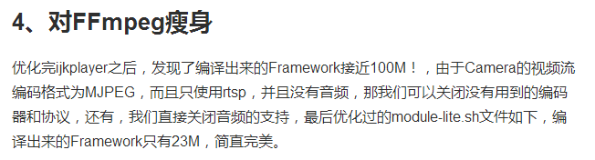
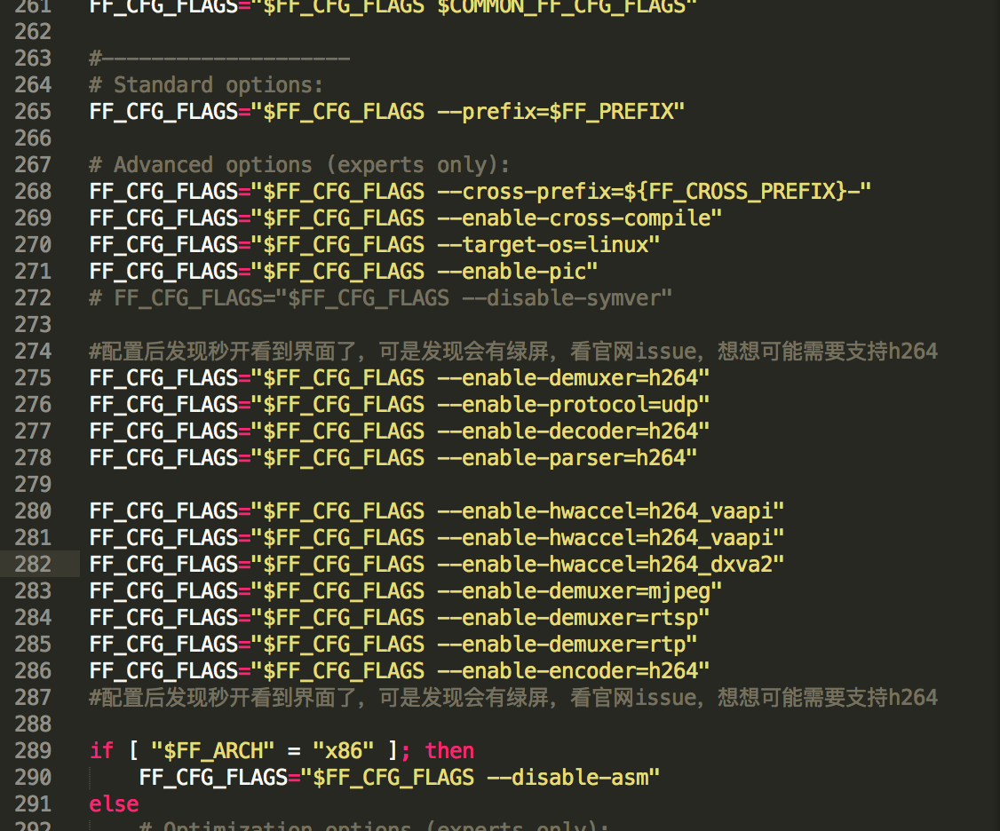

# ijkplayer-for-android

> PS:由于该项目我是按照下面提示进行操作进行优化后重新编译，运行后只支持 rtsp 流。



### ijkplayer开启rtsp

1.获取源码

git clone https://github.com/Bilibili/ijkplayer.git ijkplayer-android</br>
cd ijkplayer-android</br>
git checkout -B latest k0.8.4</br>

2.定位到 ijkplayer-android/config 修改 module-lite.sh ，并终端执行命令

https://www.jianshu.com/p/3f78da1c6a61

rm module.sh</br>
ln -s module-lite.sh module.sh

3.定位到 ijkplayer-android ，终端执行命令

sh init-android.sh

> PS:该过程要获取 FFmpeg 源码过程可能比较久，请耐心等待

4.定位到 ijkplayer-android/android/contrib ，编译 FFmpeg

sh compile-ffmpeg.sh clean</br>
sh compile-ffmpeg.sh all

5.定位到 ijkplayer-android/android ，生成 so 文件

sh compile-ijk.sh all

6.定位到 ijkplayer-android/android/ijkplayer ，根据自己的需要导入项目即可

> PS:</br>
> 若出现 rtsp 可以播放但视频出现绿屏问题，解决方法是：定位到 ijkplayer-android/android/contrib/tools/do-compile-ffmpeg.sh ，然后添加以下代码即可：

```
#配置后发现秒开看到界面了，可是发现会有绿屏，看官网issue，想想可能需要支持h264
FF_CFG_FLAGS="$FF_CFG_FLAGS --enable-demuxer=h264"
FF_CFG_FLAGS="$FF_CFG_FLAGS --enable-protocol=udp"
FF_CFG_FLAGS="$FF_CFG_FLAGS --enable-decoder=h264"
FF_CFG_FLAGS="$FF_CFG_FLAGS --enable-parser=h264"

FF_CFG_FLAGS="$FF_CFG_FLAGS --enable-hwaccel=h264_vaapi"
FF_CFG_FLAGS="$FF_CFG_FLAGS --enable-hwaccel=h264_vaapi"
FF_CFG_FLAGS="$FF_CFG_FLAGS --enable-hwaccel=h264_dxva2"
FF_CFG_FLAGS="$FF_CFG_FLAGS --enable-demuxer=mjpeg"
FF_CFG_FLAGS="$FF_CFG_FLAGS --enable-demuxer=rtsp"
FF_CFG_FLAGS="$FF_CFG_FLAGS --enable-demuxer=rtp"
FF_CFG_FLAGS="$FF_CFG_FLAGS --enable-encoder=h264"
#配置后发现秒开看到界面了，可是发现会有绿屏，看官网issue，想想可能需要支持h264
```

